<div align="center">

# 〰️ fbm-wavelets 〰️

**Analysis and synthesis of fractional Brownian motion through wavelets**

Exact sampling · three synthesis methods · Hurst estimation (DWT and CWT) · Haar coefficient correlations

<table>
  <tr>
    <td align="center" valign="top" width="260">
      <a href="https://github.com/maximilien-mahdhi"></a><br>
      <b>Maximilien MAHDHI</b><br>
      <sub>Design and implementation</sub><br>
      <sub><a href="https://github.com/maximilien-mahdhi">GitHub</a> · <a href="https://www.linkedin.com/in/maximilien-mahdhi">LinkedIn</a></sub>
    </td>
    <td align="center" valign="middle" width="260">
      <a href="https://github.com/aledev480"></a><br>
      <b>Alexis LE MEUR</b><br>
      <sub>Contributor</sub>
      <br><sub><a href="https://github.com/aledev480">GitHub</a></sub>
    </td>
  </tr>
</table>


<br>

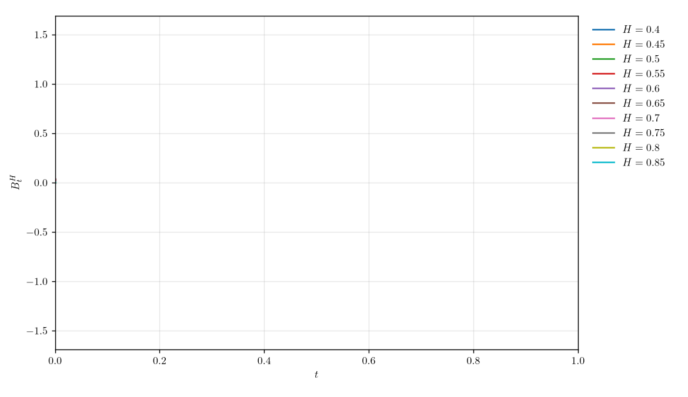

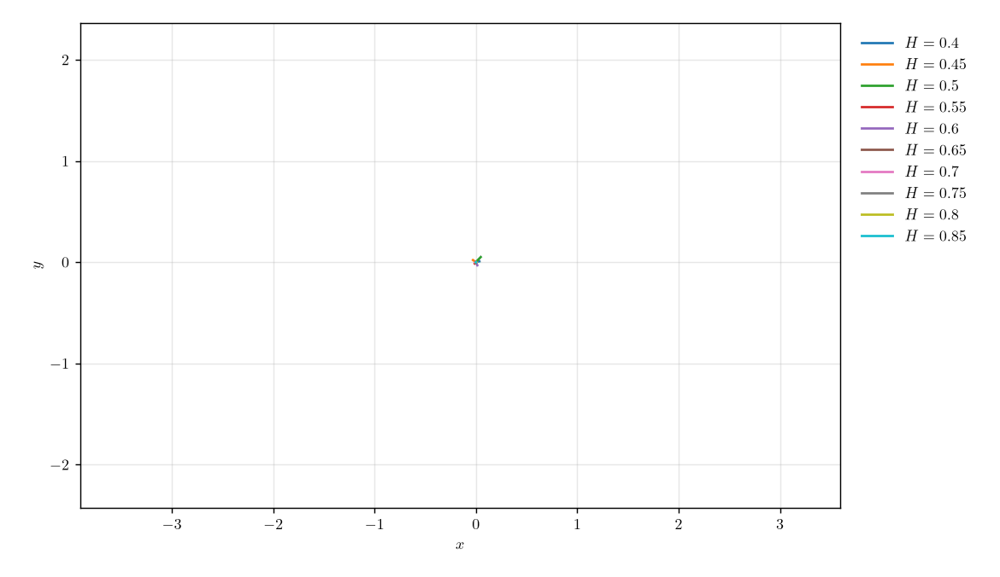

<sub><code>python scripts/make_gif.py -r 0.4 0.85 0.05</code> &nbsp;·&nbsp; <code>python scripts/make_gif.py -r 0.4 0.85 0.05 --dim 2</code></sub>

</div>

## Table of contents

- [Overview](#overview)
- [Installation](#installation)
- [Quick start](#quick-start)
- [Experiments and results](#experiments-and-results)
- [Background](#background)
- [Project structure](#project-structure)
- [API reference](#api-reference)
- [Development and design notes](#development-and-design-notes)
- [References](#references)

---

## Overview

A fractional Brownian motion $B^H_t$ is the unique centered Gaussian process with stationary increments that is self-similar with index $H \in (0, 1)$. The Hurst parameter $H$ controls the roughness of the paths and the memory of the increments. This repository gathers, in one tested package:

| Topic | What is implemented |
| --- | --- |
| **Sampling** | Exact Davies-Harte sampling of fBm and fractional Gaussian noise, multidimensional paths with animation |
| **Synthesis** | Wavelet-based synthesis (inverse DWT), Wornell-type synthesis (sum of dilated wavelets), random midpoint displacement |
| **Estimation** | Hurst estimators from the log-variance of DWT and CWT coefficients, with a regression diagnostic |
| **Theory** | Closed-form correlation of Haar wavelet coefficients, checked against numerical integration |
| **Spectrum** | Time-frequency spectrum of fBm as a function of $H$ |

This package accompanies the project study report [*A Wavelet Analysis on Fractional Brownian Motion*](docs/A_Wavelet_Analysis_on_Fractional_Brownian_Motion_Le_Meur_Mahdhi.pdf) by Alexis LE MEUR and Maximilien MAHDHI (supervised by Kévin Polisano, Université Grenoble Alpes, January 2026), based on P. Flandrin's article on the spectrum of fractional Brownian motions. The mathematical notation of this README, of the docstrings and of the figures follows the report.

## Installation

The instructions below target Linux (Debian/Ubuntu).

```bash
git clone https://github.com/maximilien-mahdhi/fbm-wavelets.git
cd fbm-wavelets
python3 -m venv .venv
source .venv/bin/activate
pip install -e ".[dev]"
```

Figures are rendered with LaTeX by default, which requires a LaTeX distribution:

```bash
sudo apt install texlive-latex-extra texlive-fonts-recommended cm-super dvipng
```

> [!NOTE]
> Without LaTeX, pass `--no-usetex` to any script to use matplotlib's built-in mathtext instead.

## Quick start

### Command line

```bash
python scripts/run_experiment.py hurst-dwt                 # one experiment
python scripts/run_experiment.py hurst-dwt fbm-paths       # several
python scripts/run_experiment.py all                       # every default experiment
python scripts/run_experiment.py hurst-error               # slow sweep over H (about 1 min)
python scripts/run_experiment.py all --format pdf --seed 55
python scripts/run_experiment.py all --no-usetex           # without LaTeX
```

| Option | Default | Description |
| --- | --- | --- |
| `--save-dir` | `results` | Output directory for figures and tables |
| `--format` | `png` | `png`, `pdf` or `svg` |
| `--seed` | `55` | Seed of the random number generators |
| `--usetex / --no-usetex` | `--usetex` | Render text with LaTeX |
| `--log-level` | `INFO` | `DEBUG`, `INFO`, `WARNING` or `ERROR` |

### Generate your own series

`scripts/generate_fbm.py` generates fBm series for any Hurst parameters, with exact sampling or with one of the synthesis methods, without editing the code. Every frequently used option has a short flag.

```bash
python scripts/generate_fbm.py -H 0.3 0.6 -n 5                       # 5 series for H = 0.3 and 5 for H = 0.6
python scripts/generate_fbm.py -r 0.4 0.85 0.05                      # H = 0.4, 0.45, ..., 0.85
python scripts/generate_fbm.py -H 0.5 -n 10 -l single -c series      # 10 series, one color each
python scripts/generate_fbm.py -H 0.3 0.6 -n 5 -m rmd -l single      # midpoint displacement
python scripts/generate_fbm.py -H 0.2 0.5 0.8 -n 3 -v 50 --save-data
python scripts/generate_fbm.py -H 0.7 -m wavelet --levels 10 --wavelet db8
```

| Option | Default | Description |
| --- | --- | --- |
| `-H`, `--hurst H [H ...]` | one of the two required | One or more Hurst parameters in (0, 1) |
| `-r`, `--hurst-range START STOP STEP` | one of the two required | Hurst parameters `START, START + STEP, ..., STOP` (both ends included) |
| `-n`, `--nb-series` | `1` | Number of series per Hurst value |
| `-N`, `--nb-points` | `1000` | Samples per series (`1024` for `wornell`); ignored by `rmd` and `wavelet` |
| `-m`, `--method` | `daviesharte` | Exact: `daviesharte`, `cholesky`, `hosking`. Approximate synthesis: `rmd`, `wavelet`, `wornell` |
| `-l`, `--layout` | `auto` | `subplots` (one panel per H), `single` (one axis) or `separate` (one figure per H). `auto` uses `subplots` for up to 3 values of H and `single` otherwise |
| `-c`, `--color-by` | `hurst` | With `single`: one color per `hurst` value or one color per `series` (matplotlib default colors) |
| `-v`, `--variance` | none | Rescale each series to this empirical variance |
| `--levels` | per method | Number of scales $J$: `rmd` gives $2^J + 1$ samples (default 10), `wavelet` gives $2^J$ (default 8), `wornell` sums $J$ octaves (default 6) |
| `--wavelet` | `db4` | Mother wavelet of the `wavelet` and `wornell` methods |
| `--t0`, `--t1` | `0`, `1` | Time interval |
| `--save-data` | off | Also write the series to a `.npz` file |

### Animated GIFs

`scripts/make_gif.py` draws the paths progressively. It accepts every generation option of the table above (`-H`/`-r`, `-n`, `-N`, `-m`, `--levels`, `--wavelet`, `-v`, `--t0`/`--t1`, `--seed`), plus the following.

```bash
python scripts/make_gif.py -r 0.4 0.85 0.05                    # B^H_t against t
python scripts/make_gif.py -r 0.4 0.85 0.05 --dim 2            # planar paths
python scripts/make_gif.py -H 0.3 0.7 -n 3 --fps 30 --hold 2   # 3 series per H, 2 s pause at the end
python scripts/make_gif.py -H 0.5 -n 10 -c series -m rmd       # one color per series, midpoint displacement
```

| Option | Default | Description |
| --- | --- | --- |
| `-d`, `--dim` | `1` | `1`: $B^H_t$ against $t$. `2`: planar paths, whose two coordinates are independent fBm of the same $H$ |
| `-c`, `--color-by` | `hurst` | One color per `hurst` value (with a legend) or one per `series` |
| `--frames`, `--fps` | `80`, `20` | Number of frames and frame rate |
| `--hold` | `1.0` | Seconds the last frame stays on screen |
| `--dpi`, `--figsize W H` | `130`, `9 5.2` | Resolution and figure size (inches) |
| `--linewidth` | `1.5` | Line width |
| `--legend` / `--no-legend` | legend when coloring by `hurst` | Show or hide the legend |
| `--output` | `results/fbm_animation.gif` (`_2d` with `--dim 2`) | Output file |
| `--seed`, `--usetex/--no-usetex`, `--log-level` | `55`, `--usetex`, `INFO` | Seed, LaTeX rendering, verbosity |

### Python

```python
from fbmwavelets import generate_fbm, estimate_hurst_dwt, estimate_hurst_cwt
from fbmwavelets.logger import setup_logging

setup_logging()

t, series = generate_fbm(0.7, nb_points=2**12)  # {0.7: array of shape (1, 4096)}
path = series[0.7][0]

dwt = estimate_hurst_dwt(path)  # HurstEstimate
cwt = estimate_hurst_cwt(path)
print(f"DWT: {dwt.hurst:.3f}   CWT: {cwt.hurst:.3f}   (true H = 0.7)")
```

```python
from fbmwavelets import wavelet_synthesis, wornell_synthesis, rmd_synthesis, haar_correlation

x = wavelet_synthesis(0.7, J=10, rng=0)  # 1024 samples, reproducible
y = wornell_synthesis(0.3, J=6, N=1024, rng=1)
z = rmd_synthesis(0.5, J=10, rng=2)  # 1025 samples
rho = haar_correlation(j=0, lag=3, hurst=0.7)  # scalar or broadcast arrays
```

## Experiments and results

Each experiment is a function registered in `fbmwavelets/experiments.py` and callable by name from the CLI.

| Name | Output in `results/` | Description |
| --- | --- | --- |
| `brownian-motion` | `brownian_motion.png` | 2D Brownian path |
| `brownian-animation` | `brownian_motion.gif` | Animated 2D path (opt-in) |
| `fbm-paths` | `fbm_paths.png` | Davies-Harte paths for $H \in \{0.2, 0.5, 0.8\}$ |
| `synthesis-wavelet` | `synthesis_wavelet.png` | Inverse-DWT synthesis |
| `synthesis-wornell` | `synthesis_wornell.png` | Wornell-type synthesis |
| `synthesis-rmd` | `synthesis_rmd.png` | Random midpoint displacement |
| `hurst-dwt` | `hurst_dwt_diagram.png` | DWT log-variance diagram and estimates |
| `hurst-table` | `hurst_table.tex` | LaTeX table of true values, estimates and errors |
| `hurst-error` | `hurst_error.png` | DWT vs CWT absolute error over a fine grid of $H$ (slow, opt-in) |
| `haar-correlation` | 4 PNG files | 3D surface and slices of the Haar correlation |
| `fbm-spectrum` | `fbm_spectrum.png` | Time-frequency spectrum for $H \in \{0.1, 0.5, 0.9\}$ |

`all` runs every experiment except `brownian-animation` and `hurst-error`.

### Hurst estimation

On $n = 4096$ samples, one path per value of $H$ (seed 55), the mean absolute error over a grid of 99 values of $H$ is **0.064 for the DWT** and **0.054 for the CWT**. The error is concentrated near the boundaries of $(0, 1)$, where the paths are either extremely rough or extremely smooth.

<div align="center">
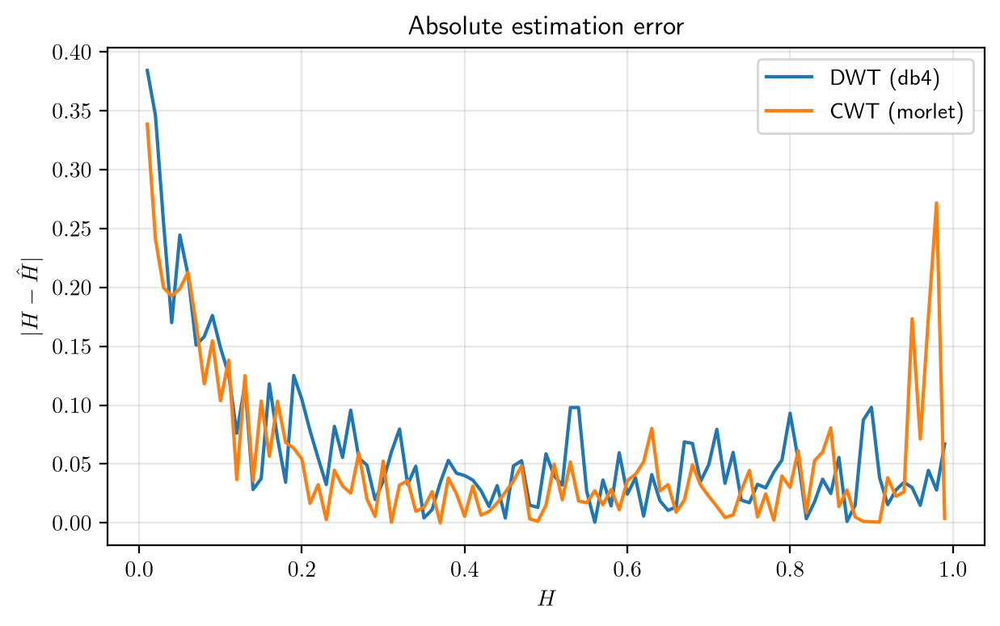
</div>

<details>
<summary><b>DWT estimates on a single path per H (table)</b></summary>

<br>

| $H$ | 0.1 | 0.2 | 0.3 | 0.4 | 0.6 | 0.7 | 0.8 | 0.9 |
| --- | --- | --- | --- | --- | --- | --- | --- | --- |
| $\hat H$ | −0.050 | 0.089 | 0.266 | 0.418 | 0.524 | 0.631 | 0.805 | 0.891 |
| $\lvert H - \hat H \rvert$ | 0.150 | 0.112 | 0.034 | 0.018 | 0.076 | 0.069 | 0.005 | 0.010 |

The same table is produced as LaTeX by `hurst-table`. Single-path estimates fluctuate: the figure above is a better summary of accuracy than any single column.

</details>

<div align="center">
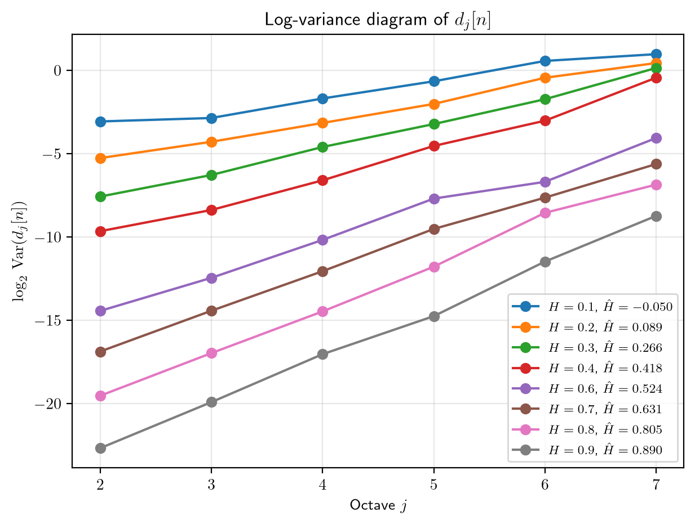
</div>

### Wavelet synthesis

<div align="center">
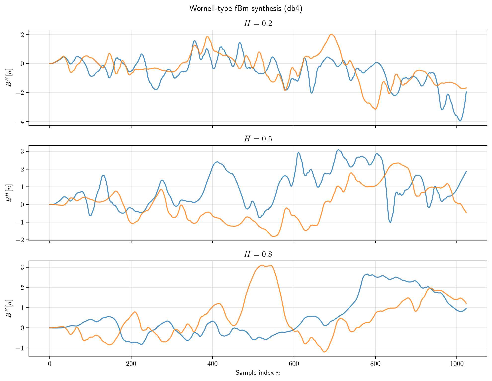
<br><sub>Wornell-type synthesis</sub>
</div>

<details>
<summary><b>Other synthesis methods</b></summary>

<br>

<table>
<tr>
<td align="center">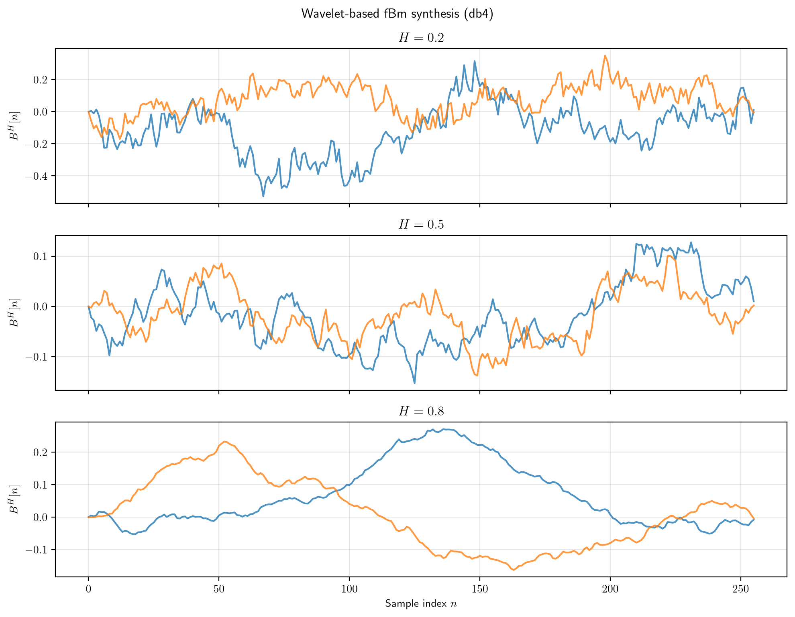<br><sub>Inverse-DWT synthesis</sub></td>
<td align="center">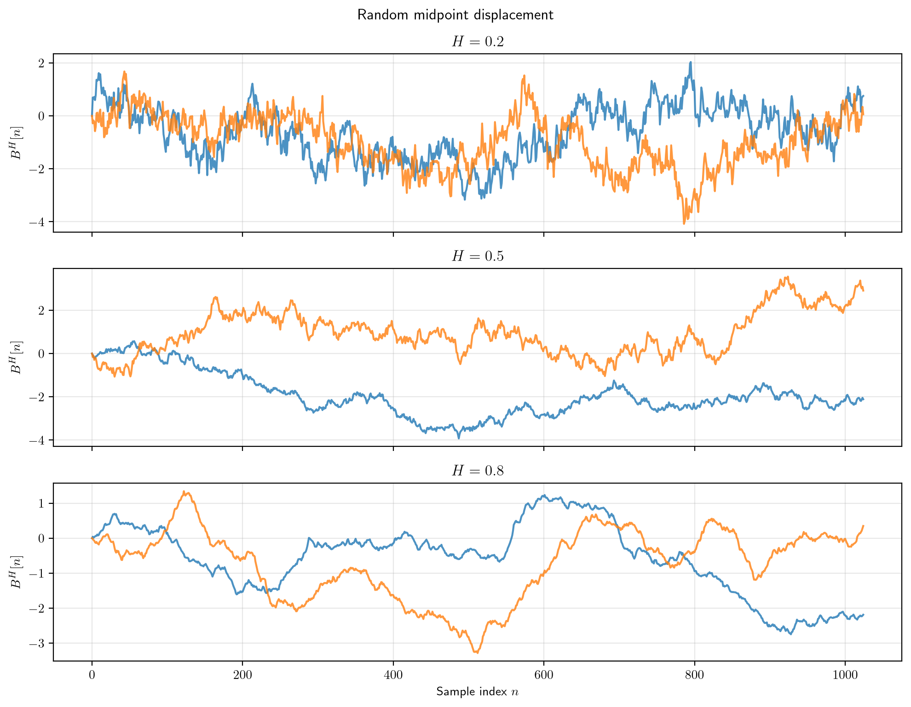<br><sub>Random midpoint displacement</sub></td>
</tr>
</table>

</details>

### Haar coefficient correlation

<div align="center">
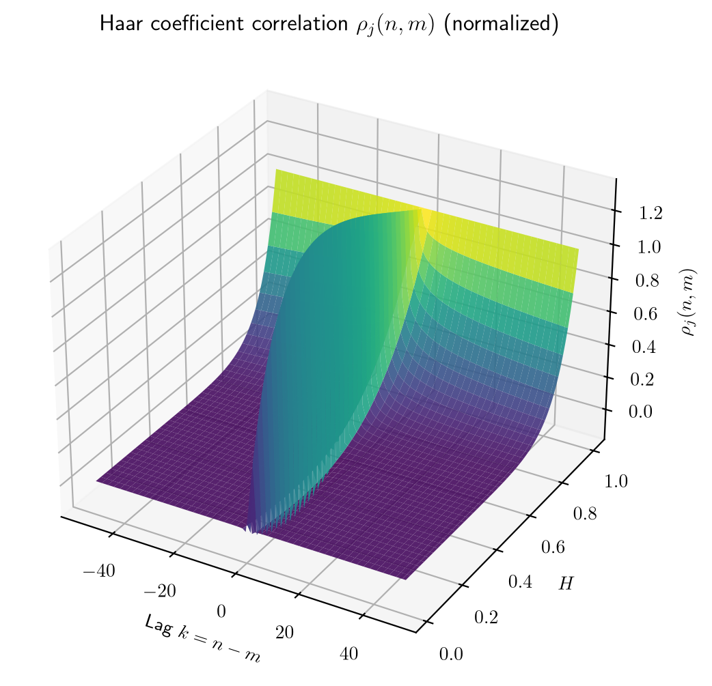
</div>

<details>
<summary><b>Slices in lag, scale and H</b></summary>

<br>

<table>
<tr>
<td>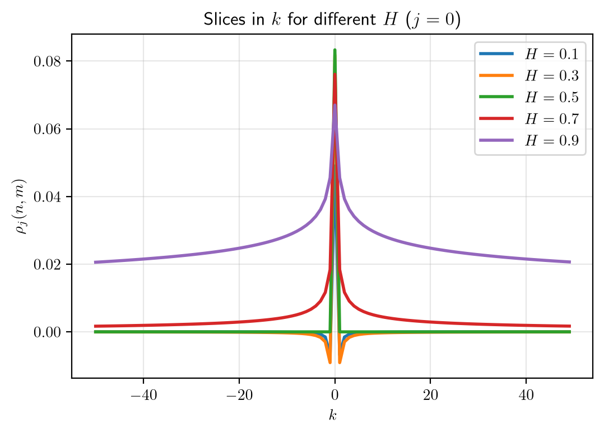</td>
<td>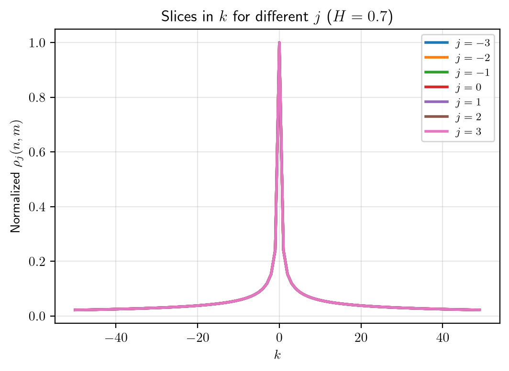</td>
<td>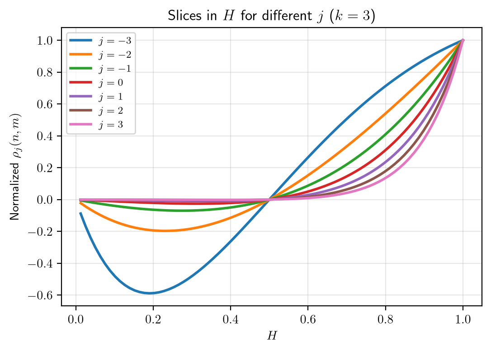</td>
</tr>
</table>

</details>

### Time-frequency spectrum

<div align="center">
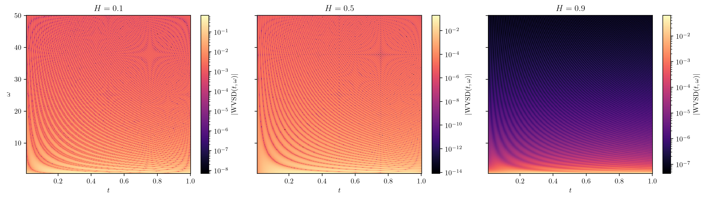
</div>

The wavelet-based spectrum of fBm is the Wigner-Ville Spectral Density (WVSD) $S_{B_HB_H}(t, \omega) = \sigma_H^2\,\dfrac{1 - 2^{1-2H}\cos(4\pi\omega t)}{|2\pi\omega|^{2H+1}}$, shown as $|S_{B_HB_H}|$ on a logarithmic color scale; its time average is the Averaged Wigner-Ville Spectral Density (AWVSD) $\mathscr{S}_{B_H}(\omega) = \sigma_H^2 / |2\pi\omega|^{2H+1}$.

## Background

<details>
<summary><b>Definitions, estimators, Haar correlation and synthesis methods</b></summary>

<br>

**Self-similarity.** The fBm $(B^H_t)_{t\in\mathbb{R}}$ is a centered Gaussian process with $\sigma_H^2 := \mathrm{Var}(B^H_1)$, such that $B^H_{at} \overset{d}{=} a^{H} B^H_t$ and $\mathrm{Var}(B^H_t) = \sigma_H^2\,|t|^{2H}$. Its covariance is

$$\mathbb{E}\big[B^H_s B^H_t\big] = \tfrac{\sigma_H^2}{2}\left(|s|^{2H} + |t|^{2H} - |t-s|^{2H}\right).$$

**Wavelet scaling.** With $\psi_{j,n}(t) = 2^{-j/2}\,\psi(2^{-j}t - n)$, the detail coefficients $d_j[n] = \langle B^H, \psi_{j,n}\rangle$ of an fBm at octave $j$ (with $j = 1$ the finest scale) satisfy

$$\mathrm{Var}\big(d_j[n]\big) = V_\psi(H)\,\big(2^{j}\big)^{2H+1}.$$

**Estimator.** The regression of $\log_2 \mathrm{Var}(d_j[n])$ against $j$ has slope $2H + 1$, hence

$$\widehat H := \frac{\mathrm{slope}\big(\log_2 \mathrm{Var}(d_j[n])\big) - 1}{2}.$$

The same relation is used with the DWT (dyadic scales, fast) and the CWT $W(a, b)$, for which $\mathbb{E}|W(a,b)|^2 \sim C_\psi\,a^{2H+1}$ (scales $a = 2^1, \dots, 2^{j_{\max}}$, Morlet wavelet).

**Haar coefficient correlation.** For the Haar wavelet $\psi := \mathbb{1}_{[0,1/2]} - \mathbb{1}_{[1/2,1]}$, the correlation $\rho_j(n, m) := \mathbb{E}\big[d_j[n]\,d_j[m]\big]$ of two coefficients at lag $k = n - m$ is

$$\rho_j(n, m) = \frac{\sigma_H^2}{2}\,\xi_H[n-m]\,\big(2^{j}\big)^{2H+1},$$

with, for $k \neq 0$,

$$\xi_H[k] = \frac{(|k|-1)^{2H+2} - 4\big(|k|-\tfrac12\big)^{2H+2} + 6|k|^{2H+2} - 4\big(|k|+\tfrac12\big)^{2H+2} + (|k|+1)^{2H+2}}{(2H+1)(2H+2)},$$

and $\xi_H[0] = \dfrac{1 - 2^{-2H}}{(H+1)(2H+1)}$.

### Synthesis methods

Three approximate generators are provided, selected with `-m` in `generate_fbm.py`. They all rely on the same idea: the wavelet coefficients of an fBm have variance $(2^j)^{2H+1}$, so building a signal from independent Gaussian coefficients with that scaling produces a process with Hurst parameter $H$.

| Method (`-m`) | Principle | Output |
| --- | --- | --- |
| `wavelet` | **Inverse DWT.** Draw independent Gaussian detail coefficients at each resolution level $m$ (fine to coarse), with standard deviation $2^{-(H+1/2)m}$, then apply the inverse DWT. | $2^J$ samples |
| `wornell` | **Wornell synthesis.** Sum of dilated and translated wavelets $\widetilde B^H_t = \sum_{j}\sum_{n} 2^{-j/2}\,d_j[n]\,\psi(2^{-j}t-n)$, where the $d_j[n]$ are independent centered Gaussian detail coefficients with $\mathrm{Var}(d_j[n]) \propto (2^j)^{2H+1}$, evaluated on a tabulated wavelet. In the code the scale index is $m = -j$, so each term has amplitude $2^{-mH}$ on $\psi(2^m t - n)$. | $N$ samples, $J$ octaves |
| `rmd` | **Random midpoint displacement.** Each segment midpoint is the mean of its endpoints plus a Gaussian displacement of standard deviation $\mathrm{scale}^H$; the scale is halved after each level. | $2^J + 1$ samples |

All three are normalized (unit standard deviation, or start at 0) and are approximations: for exact samples use `daviesharte`, `cholesky` or `hosking`. With a finite number of octaves the effective Hurst exponent can deviate somewhat from the requested $H$.

</details>

## Project structure

```
fbm-wavelets/
├── pyproject.toml              # packaging (hatchling), dependencies, ruff and pytest config
├── README.md
├── .github/workflows/ci.yml    # lint + tests on Python 3.10 and 3.12
├── src/fbmwavelets/
│   ├── __init__.py             # public API
│   ├── logger.py               # Rich terminal logging
│   ├── processes.py            # Path, BrownianMotion, FractionalBrownianMotion
│   ├── generators.py           # generate_fbm (Davies-Harte, Cholesky, Hosking)
│   ├── synthesis.py            # wavelet, Wornell and midpoint-displacement synthesis
│   ├── estimation.py           # estimate_hurst_dwt, estimate_hurst_cwt, HurstEstimate
│   ├── haar.py                 # xi, haar_correlation
│   ├── spectrum.py             # time_frequency_spectrum
│   ├── simulate.py             # generation options shared by the scripts
│   ├── plotting.py             # matplotlib / LaTeX setup, figure saving
│   └── experiments.py          # experiment registry
├── scripts/run_experiment.py   # run the predefined experiments
├── scripts/generate_fbm.py     # generate fBm series for chosen H
├── scripts/make_gif.py         # animated GIF of fBm paths
├── tests/                      # 35 tests
└── results/                    # generated figures and table
```

## API reference

<details>
<summary><b>Generation and processes</b></summary>

<br>

| Function / class | Description |
| --- | --- |
| `generate_fbm(hurst, nb_points=1000, nb_series=1, t0=0, t1=1, variance=None, method="daviesharte")` | Returns `(t, {H: array of shape (nb_series, nb_points)})`. If `variance` is given, each series is rescaled to that empirical variance. |
| `BrownianMotion(increment, delta, dim, initial_condition)` | Multidimensional Brownian motion; `.generate(n)` returns a `Path`. |
| `FractionalBrownianMotion(increment, delta, hurst, dim, initial_condition)` | Independent fBm coordinates; increments have standard deviation `delta * increment**hurst`. |
| `Path` | Trajectory of shape `(n, dim)` with `mean()`, `std()`, `project_on_axis()`, `plot()`, `plot_animation()`. |

</details>

<details>
<summary><b>Synthesis</b></summary>

<br>

| Function | Description |
| --- | --- |
| `wavelet_synthesis(hurst, J=8, wavelet="db4", rng=None)` | $N = 2^J$ samples; detail coefficients at resolution level $m$ have standard deviation $2^{-(H + 1/2)m}$; periodized inverse DWT. |
| `wornell_synthesis(hurst, J=6, N=1024, wavelet="db4", rng=None)` | Sum over $j, n$ of $2^{-j/2}\,d_j[n]\,\psi(2^{-j}t - n)$ with independent Gaussian $d_j[n]$ (code scale index $m = -j$); the wavelet is tabulated and interpolated; normalized to unit standard deviation. |
| `rmd_synthesis(hurst, J=10, rng=None)` | $2^J + 1$ samples by random midpoint displacement; normalized to unit standard deviation. |

`rng` accepts a `numpy.random.Generator`, an integer seed or `None`.

</details>

<details>
<summary><b>Estimation, Haar correlation and spectrum</b></summary>

<br>

| Function | Description |
| --- | --- |
| `estimate_hurst_dwt(x, wavelet="db4", j_max=8, mode="symmetric")` | Log-variance regression on DWT details; finest and coarsest octaves are dropped. |
| `estimate_hurst_cwt(x, wavelet="morl", j_max=8, trim=0.1)` | Same on CWT scales $2^1, \dots, 2^{j_{\max}}$; a fraction `trim` of samples is removed at both ends. |
| `HurstEstimate` | Frozen dataclass: `hurst`, `slope`, `intercept`, `scales`, `log_variance`, `r_value`. |
| `xi(lag, hurst)` | Discrete Haar kernel $\xi_H[k]$, for every integer lag (including $k = 0$). |
| `haar_correlation(j, lag, hurst, sigma_h=1.0)` | $\rho_j(n, m) = \frac{\sigma_H^2}{2}\,\xi_H[n-m]\,(2^j)^{2H+1}$; all arguments broadcast. |
| `time_frequency_spectrum(t, omega, hurst, sigma_h=1.0)` | $\mathrm{WVSD}(t, \omega)$; `omega` must not contain zero. |

</details>

## Development and design notes

### Design notes

- **Reproducibility.** Every experiment is seeded (`--seed`, default 55). Synthesis functions take an explicit `rng`. The `fbm` package relies on NumPy's global random state, so experiments seed it as well.
- **DWT boundary handling.** A periodized extension joins the two ends of a non-periodic path, which creates an artificial jump and biases $\hat H$ towards 0.5 for large $H$. The estimator therefore uses the `symmetric` extension by default.
- **Logging.** Library code only calls `logging.getLogger(__name__)`; handlers are configured once, by the entry point, with `setup_logging()`.
- **Optional LaTeX.** LaTeX rendering is a matplotlib setting handled in one place (`plotting.configure_matplotlib`).
- **Known limitations.** Estimates from a single short path are noisy, and accuracy degrades close to $H = 0$ and $H = 1$. For $H$ close to 1 and small $n$, the Davies-Harte embedding can be invalid; the `fbm` package then falls back to the Hosking method and emits a warning. The Wornell-type and midpoint-displacement syntheses are approximations of fBm, not exact samplers.

### Development

```bash
pip install -e ".[dev]"
ruff check . && ruff format --check .
pytest
```

The test suite (35 tests) covers:

- the Haar correlation formula against a direct numerical double integral of the fBm covariance, including symmetry in the lag and the scale factor;
- the DWT and CWT estimators on exact fBm, and on wavelet-synthesized paths;
- shapes, normalization and reproducibility of the three synthesis methods;
- the increment scale of `FractionalBrownianMotion` for several $H$;
- every default experiment, which must write a figure.

Continuous integration runs linting and tests on Python 3.10 and 3.12 (LaTeX is not needed: the tests use matplotlib's mathtext).

## References

- B. Mandelbrot, J. Van Ness, *Fractional Brownian motions, fractional noises and applications*, SIAM Review, 1968.
- R. Davies, D. Harte, *Tests for Hurst effect*, Biometrika, 1987.
- G. Wornell, *A Karhunen-Loève-like expansion for 1/f processes via wavelets*, IEEE Transactions on Information Theory, 1990.
- P. Flandrin, *Wavelet analysis and synthesis of fractional Brownian motion*, IEEE Transactions on Information Theory, 1992.
- A. Le Meur, M. Mahdhi, [*A Wavelet Analysis on Fractional Brownian Motion*](docs/A_Wavelet_Analysis_on_Fractional_Brownian_Motion_Le_Meur_Mahdhi.pdf), Project Study Report, supervised by K. Polisano, Université Grenoble Alpes, January 2026.
